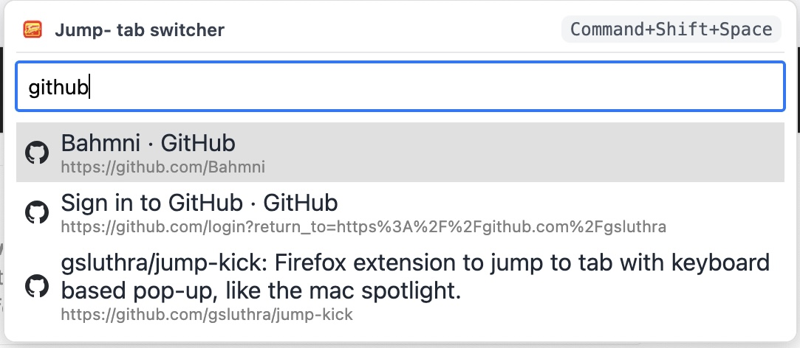
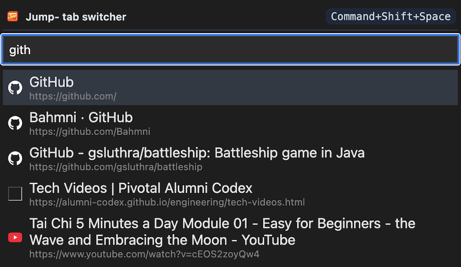
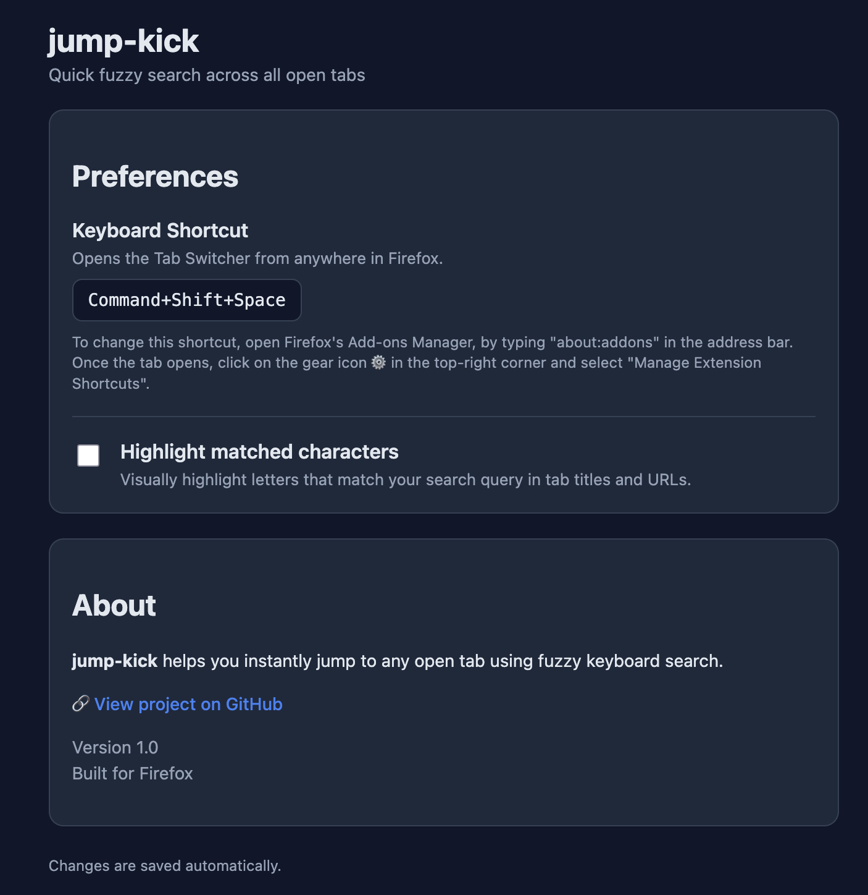
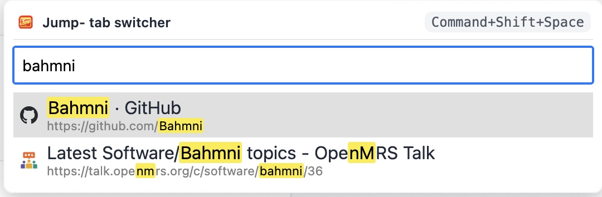

#  Jump-Kick: Lightning Fast Tab Switcher for Firefox

**Jump-Kick** lets you instantly jump to any open tab using a powerful fuzzy search — just like a command palette for your browser.

Hit a shortcut, type a few letters, and *kick* straight to the tab you want.

---

## ⚡ Features

- 🔍 **Fuzzy Search Across All Tabs**  
  Find tabs by partial words, acronyms, or fragments of URLs.

- 🕒 **Smart Ordering**  
  Recently used tabs appear first, so the ones you care about are always on top.

- ⌨️ **Keyboard First**  
  Navigate results with arrow keys and press **Enter** to switch.

- ↕️ **Sort Commands (type `sort`)**  
  Quickly sort tabs by **URL**, **domain**, **title**, or **last accessed**.

- 🌓 **Auto Light/Dark Mode**  
  Matches your Firefox theme automatically.

- 🎯 **Optional Match Highlighting**  
  Highlight matched characters (can be toggled in Settings).

- 🚀 **Zero Distractions**  
  No tracking. No network calls. Works entirely locally.

---

## ⌨️ Keyboard Shortcut

Default shortcut:

**Mac:** `Command + Shift + Space`  
**Windows/Linux:** `Ctrl + Shift + Space`

You can change this anytime:

**Firefox Menu → Add-ons → ⚙ Manage Extension Shortcuts**

---

## 🖱 How to Use

1. Press the shortcut  
2. Start typing part of a tab’s title or URL  
   - Or type `sort` to see sorting commands
3. Use ↑ ↓ arrow keys to select  
4. Press **Enter** to jump

---

## 🧠 Screenshots

---

## ⚙️ Settings

Open:

**about:addons → Jump-Kick → Preferences**

Available options:

- Toggle highlighting of matched search characters

---

## 🗼 Why Jump-Kick?

Browsers make it easy to open tabs…  
but hard to *find* the one you need.

Jump-Kick gives you:

- The speed of Spotlight  
- The feel of VS Code’s command palette  
- The simplicity of a single shortcut

---

## 🔒 Privacy

Jump-Kick:

- Does **not** collect data  
- Does **not** send anything to servers  
- Only reads tab titles and URLs locally to power search

---

## 📦 Installation

## From Firefox Online Add-ons Store 
1. Open firefox.
2. Go to URL: https://addons.mozilla.org/en-US/firefox/addon/jump-kick-quick-tab-switcher/
3. Click on "Add to Firefox" button.
4. Select "Pin to toolbar" (so you can always see it).
5. You should now be able to use the Extension (Cmd+Shift+Space on mac, or Control+Shift+Space on windows).

## Local Development Install

1. In firefox, open an new tab and type `about:debugging`
2. On the left side, select: **This Firefox**
3. Click **Load Temporary Add-on**
4. Select `manifest.json`
5. You should now be able to use the Extension.

---

## 🛠 Development

This extension is built using the Firefox WebExtensions API.

Main components:

- `popup.js` — UI + fuzzy search logic  
- `background.js` — Keyboard shortcut + tooltip  
- `options.html/js` — Settings page  
- `Fuse.js` — Lightweight fuzzy search library

Run integration tests with: `node test.js`

---

## 🌟 Contributing

Ideas, improvements, and pull requests are welcome!

If you find a bug or have a feature idea, open an issue.

---

## 📄 License

Licensed under the Apache License, Version 2.0.  
See the LICENSE.md and NOTICE.md file for details.

---

Made with ⚡ for people who live in too many tabs.